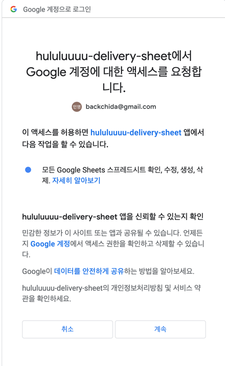
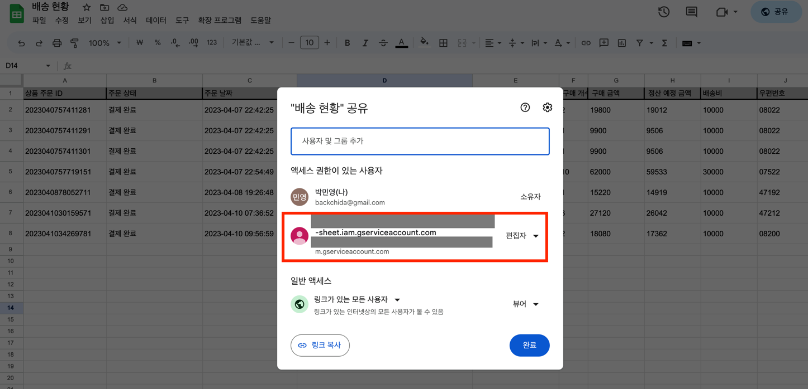

# 구글 API 사용하면서 배운 점

### Google API 호출 시 사용자 인증 화면(클라이언트 인증 화면)없이 호출하는 법

Google Oauth 를 활용하여 access token 을 얻기 위해서는 아래와 같은 클라이언트 화면에서 인증이 필요

해당 화면 없이 구글 리소스에 접근하기 위해서는 `서비스 계정` 이라는 것을 활용할 수 있다.

https://developers.google.com/shopping-content/guides/how-tos/service-accounts?hl=ko

문서에 따르면 사용자 승인이 필요하지 않음 Oauth 흐름을 사용한다.

1. 구글 프로젝트에 서비스 계정을 생성 (리소스를 사용하기 위한 이메일 계정같은 것)
2. 해당 리소스에 대한 접근 권한을 해당 이메일에 부여해주면 됨

아래와 같이 리소스 권한을 부여함

